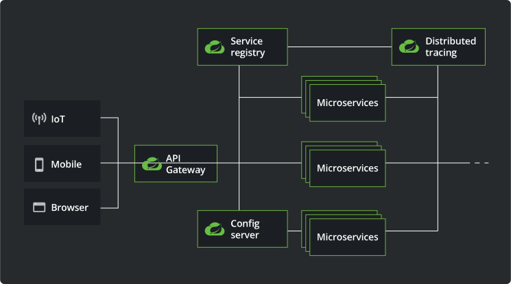

# 유레카 클라이언트 ( Eureka Client )

## Spring Cloud 아키텍처 관계도

출처 : https://spring.io/cloud

## 개발환경
- JDK : Zulu JDK 17.0.10
- SpringBoot : 3.2.3
  - `org.springframework.boot:spring-boot-starter-web`
  - `org.springframework.cloud:spring-cloud-starter-netflix-eureka-client`
- SpringBoot Eureka Client : 현재 최신버전 4.1.0
- build tools : Gradle

## Spring Cloud 버전과 Spring Boot 버전 및 JDK 의 버전 호환성
- 출처
```text
https://spring.io/projects/spring-cloud#overview  
https://github.com/spring-projects/spring-framework/wiki/Spring-Framework-Versions
```
| Release Train        | Spring Boot Generation                | JDK 버전 ( LTS ) | 비고   |
|----------------------|---------------------------------------|----------------|------|
| 2023.0.x aka Leyton  | 3.2.x                                 | JDK 17         |      |
| 2022.0.x aka Kilburn | 3.0.x, 3.1.x (Starting with 2022.0.3) | JDK 17         |      |
| 2021.0.x aka Jubilee | 2.6.x, 2.7.x (Starting with 2021.0.3) | JDK 11         |      |
| 2020.0.x aka Ilford  | 2.4.x, 2.5.x (Starting with 2020.0.3) | JDK 11         |      |
| Hoxton               | 2.2.x, 2.3.x (Starting with SR5)      | JDK 8, 11      |      |
| Greenwich            | 2.1.x                                 | JDK 8          | 지원종료 |
| Finchley             | 2.0.x                                 | JDK 8          | 지원종료 |
| Edgware              | 1.5.x                                 | JDK 6, 7, 8    | 지원종료 |
| Dalston              | 1.5.x                                 | JDK 6, 7, 8    | 지원종료 |

## Source
- 유레카 서버(Erureka Client)의 개발은 간단하다.
- 기본적으로 3개의 파일만 필요하다.
  - `build.gradle`, `EurekaClientApplication.java`,`application.yml`

#### build.gradle
```gradle
plugins {
	id 'java'
	id 'org.springframework.boot' version '3.2.3'
	id 'io.spring.dependency-management' version '1.1.4'
}

group = 'octopus'
version = '0.0.1-SNAPSHOT'

java {
	sourceCompatibility = '17'
}

repositories {
	mavenCentral()
}

ext {
	set('springCloudVersion', "2023.0.0")         // 스프링 클라우드 버전
}

dependencies {
	implementation 'org.springframework.boot:spring-boot-starter-web'
	implementation 'org.springframework.cloud:spring-cloud-starter-netflix-eureka-client'
	testImplementation 'org.springframework.boot:spring-boot-starter-test'
}

dependencyManagement {
	imports {
		mavenBom "org.springframework.cloud:spring-cloud-dependencies:${springCloudVersion}"
	}
}

tasks.named('test') {
	useJUnitPlatform()
}
```

#### EurekaClientApplication.java
```java
import org.springframework.boot.SpringApplication;
import org.springframework.boot.autoconfigure.SpringBootApplication;
import org.springframework.cloud.client.discovery.EnableDiscoveryClient;

@SpringBootApplication
@EnableDiscoveryClient
// @EnableEurekaClient        // Spring Cloud Version 2022.0 이상의 경우 사용할 수 없음.
public class EurekaClientApplication {

  public static void main(String[] args) {
    SpringApplication.run(EurekaClientApplication.class, args);
  }

}
```

#### application.yml
```yml
spring:
  application:
    name: EurekaClient

server:
  port: 9191

eureka:
  client:
    fetch-registry: true
    register-with-eureka: true
    service-url:
      defaultZone: http://localhost:8761/eureka/         #Eureka Server ??
  instance:
    hostname: localhost
```

## Build
#### 프로젝트 디렉토리에서 실행한다.
```text
$ ./gradlew bootJar
```

## 실행
#### 파일 찾기
```text
$ find . -name '*.jar'                                   
./gradle/wrapper/gradle-wrapper.jar
./build/libs/EurekaClient-0.0.1-SNAPSHOT.jar
```

#### jar 실행
- [프로젝트 디렉토리]/build/libs 폴더에 Build 됨.
- `java -jar EurekaClient-0.0.1-SNAPSHOT.jar `
```text
# java -jar ./workspace/EurekaServer/build/libs/EurekaClient-0.0.1-SNAPSHOT.jar
# java -jar EurekaClient-0.0.1-SNAPSHOT.jar                               

  .   ____          _            __ _ _
 /\\ / ___'_ __ _ _(_)_ __  __ _ \ \ \ \
( ( )\___ | '_ | '_| | '_ \/ _` | \ \ \ \
 \\/  ___)| |_)| | | | | || (_| |  ) ) ) )
  '  |____| .__|_| |_|_| |_\__, | / / / /
 =========|_|==============|___/=/_/_/_/
 :: Spring Boot ::                (v3.2.3)
```

## Git Push
```git
git init
git add README.md
git commit -m "first commit"
git branch -M main
git remote add origin https://github.com/hermeswing/EurekaClient.git
git push -u origin main
```

## 오류
```text
org.springframework.context.ApplicationContextException: Failed to start bean 'eurekaAutoServiceRegistration'
	at org.springframework.context.support.DefaultLifecycleProcessor.doStart(DefaultLifecycleProcessor.java:291) ~[spring-context-6.1.4.jar:6.1.4]
	at org.springframework.context.support.DefaultLifecycleProcessor$LifecycleGroup.start(DefaultLifecycleProcessor.java:471) ~[spring-context-6.1.4.jar:6.1.4]
	at java.base/java.lang.Iterable.forEach(Iterable.java:75) ~[na:na]
	at org.springframework.context.support.DefaultLifecycleProcessor.startBeans(DefaultLifecycleProcessor.java:260) ~[spring-context-6.1.4.jar:6.1.4]
	at org.springframework.context.support.DefaultLifecycleProcessor.onRefresh(DefaultLifecycleProcessor.java:205) ~[spring-context-6.1.4.jar:6.1.4]
	at org.springframework.context.support.AbstractApplicationContext.finishRefresh(AbstractApplicationContext.java:978) ~[spring-context-6.1.4.jar:6.1.4]
	at org.springframework.context.support.AbstractApplicationContext.refresh(AbstractApplicationContext.java:627) ~[spring-context-6.1.4.jar:6.1.4]
	at org.springframework.boot.SpringApplication.refresh(SpringApplication.java:754) ~[spring-boot-3.2.3.jar:3.2.3]
	at org.springframework.boot.SpringApplication.refreshContext(SpringApplication.java:456) ~[spring-boot-3.2.3.jar:3.2.3]
	at org.springframework.boot.SpringApplication.run(SpringApplication.java:334) ~[spring-boot-3.2.3.jar:3.2.3]
	at org.springframework.boot.SpringApplication.run(SpringApplication.java:1354) ~[spring-boot-3.2.3.jar:3.2.3]
	at org.springframework.boot.SpringApplication.run(SpringApplication.java:1343) ~[spring-boot-3.2.3.jar:3.2.3]
	at octopus.EurekaClientApplication.main(EurekaClientApplication.java:10) ~[main/:na]
Caused by: java.lang.NullPointerException: Cannot invoke "org.springframework.cloud.netflix.eureka.CloudEurekaClient.getApplications()" because the return value of "org.springframework.cloud.netflix.eureka.serviceregistry.EurekaRegistration.getEurekaClient()" is null
	at org.springframework.cloud.netflix.eureka.serviceregistry.EurekaServiceRegistry.maybeInitializeClient(EurekaServiceRegistry.java:54) ~[spring-cloud-netflix-eureka-client-4.1.0.jar:4.1.0]
	at org.springframework.cloud.netflix.eureka.serviceregistry.EurekaServiceRegistry.register(EurekaServiceRegistry.java:38) ~[spring-cloud-netflix-eureka-client-4.1.0.jar:4.1.0]
	at org.springframework.cloud.netflix.eureka.serviceregistry.EurekaAutoServiceRegistration.start(EurekaAutoServiceRegistration.java:83) ~[spring-cloud-netflix-eureka-client-4.1.0.jar:4.1.0]
	at org.springframework.context.support.DefaultLifecycleProcessor.doStart(DefaultLifecycleProcessor.java:288) ~[spring-context-6.1.4.jar:6.1.4]
	... 12 common frames omitted
```
- 명확한 원인은 아니지만,
  - `@EnableEurekaClient` Spring Cloud Version 2022.0 이상의 경우 사용할 수 없다고 함. ( 되는 예제가 있는 것 같던데.. ㅡㅡㅋ )
  - Runtime or Compile JDK 버전이 상이 해서라는 대답이 꽤 많았음.
  - 나의 경우는
    - ***implementation 'org.springframework.boot:spring-boot-starter-web'를 추가하니 해결됨.***


## 참고.
> https://github.com/eugenp/tutorials/tree/master/spring-cloud-modules  
> https://velog.io/@rockstar/Spring-Cloud-Eureka-Server-%EC%84%A4%EC%A0%95-%EB%B0%8F-MSA-%ED%86%B5%EC%8B%A0-%EB%B0%A9%EB%B2%95  
> https://velog.io/@ililil9482/MSA-%EA%B5%AC%EC%84%B1-Discovery-Gateway-Config  
> https://github.com/Jimoou/springboot-microservices?tab=readme-ov-file  
